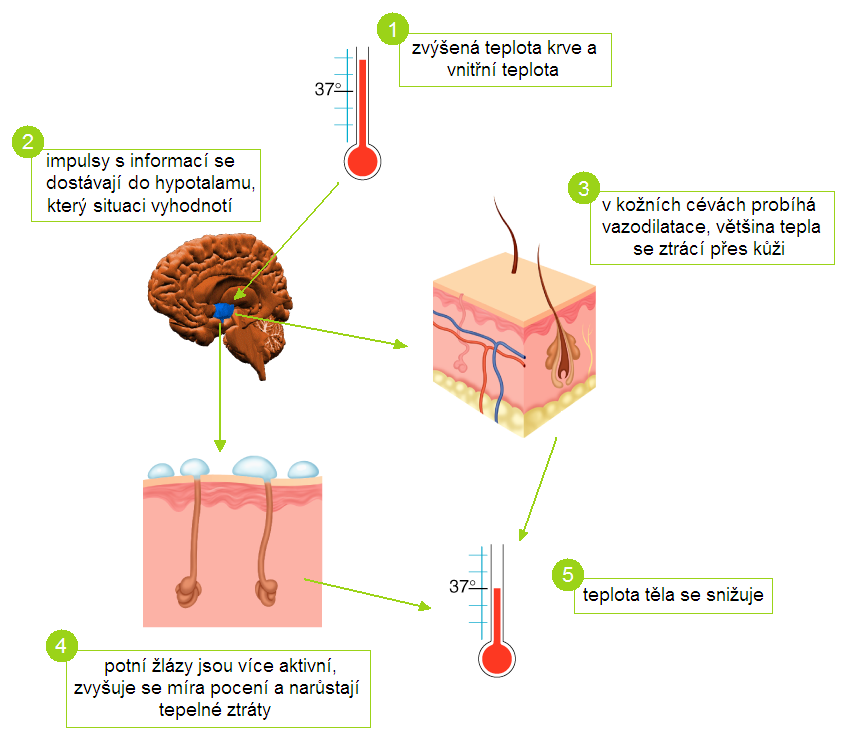

# Tělesná teplota

## Pojmy

**vazodilatace** - rozšíření cévy

**vazokonstrikce** - stahování cévy

**úžeh** - poškození organismu slunečním zářením na oblast hlavy a krku

**úpal** - poškození organismu teplem

**hypotermie** - podchlazení, teplota pod úrovní potřebnou pro běžný metabolismus a fungování

## Termoregulace

- savci - teplokrevní živočichové (homoiotermní) -> stálá tělesná teplota
- průměrná tělesná teplota: 36-37 °C
- nejnižší brzy ráno (3. hodina), nejvyšší večer (18. hodina)
- nejvyšší tělesná teplota je ve středu těla v okolí důležitých orgánů, směrem k povrchu se teplota snižuje

### Tvorba tepla

- metabolické děje
- svalová námaha - podílí se na tvorbě těla až z 90 %
- svalový třes (když klesne teplota těla pod 35,5 °C)
- netřesová termogeneze - význam hlavně u novorozenců - katabolismus hnědého tuku

### Výdej tepla

- kontrolu tepelných ztrát organismu zajišťují temoizolační vlastnosti jednotlivých tkání

#### Tepelná izolace

- **krev** přenáší teplo cévním systémem z jádra na periferii
- ztrátám tepla se tělo chrání vazokonstrikcí
- **kůže, podkoží a tuk** - mají třetinovou schopnost vést teplo a před ztrátami tepla organismus chrání

#### Typy výdeje tepla

##### 1. Sálání

- vazodilatace

##### 2. Vedení tepla

- z kůže do okolí (po teplotním spádu)

##### 3. Pocení

- potem se ztrácí až 80 % tepla
- vysoká vlhkost vzduchu - brání odpařování vody a hrozí přehřátí
- pocením při vysokých teplotách hrozí *dehydratace a ztráta solí*

### Řízení tělesné teploty

#### 1. Nervově

- nervové centrum termoregulace v hypotalamu

#### 2. hormonálně

- hormony štítné žlázy a dřeně nadledvinek

### Podstata termoregulace

- udržet stálou teplotu tělesného jádra cca 36,5 °C

37 - 38 °C

- zvýšená teplota

\> 38 °C

- vysoká teplota (horečka)

\> 42 °C

- hrozí poškození mozku

< 35 °C

- hypotermie

V chladu - vazokonstrikce kožních vlásečnic a špatné prokrvení končetin -> při dlouhodobém chladu dojde k pasivní vazodilataci, zpomalí se průtok krve v končetinách -> promodrávání prstů a rtů -> omrzliny až smrt

#### Hypertermie

- horečka - obranná reakce na infekci vyvolána pyrogeny = látky, které uvolňují leukocyty při infekci

#### Úžeh

- vyvolán působením intenzivního slunečního záření

#### Úpal

- vzniká nahromaděním tepla v těle při špatné termoregulaci (v prostředí s vysokou teplotou a vlhkostí)

