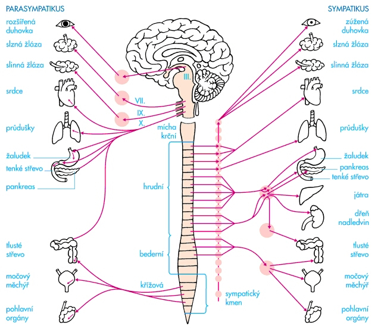

# Vegetativní nervový systém

- autonomní, útrobní
- řídí činnost hladkého svalstva, žláz, srdce
- nezávisí na naší vůli

- 2 systémy s antagonistickým účinkem

## 2 systéma s antagonistickým účinkem

::: details Obr. 1
Místo duhovky správně zornice
:::

- činnost sympatiku a parasympatiku je koordinována nadřazenými oblastmi CNS
- regulační úrovně
  - **mícha** - jednoduché reflexní řízení (vyprazdňování moč. měchýře a střev, pohlavní funkce)
  - **prodloužená mícha** - regulace složitějších vegetativních funkcí
  - **Hypotalamus** - nevyšší centrum vegetativního systému

### 1. **Sympatikus**

- vlákna vycházejí společně s míšními nervy z hrudní a bederní míchy  
- synapse sympatiku je uložena v gnagliích (uzlinách) podél páteře, ganglia jsou propojena nervovými vlákny - sympatický kmen
- mediátorem - adrenalin a noradrenalin
- stimulující účinek (př. zrychlení činnosti srdce, zvýšení KT, rozšíření zornic, potlačení trávicích procesů) - příprava organismu na zátěž fyzickou a psychickou

### 2. **Parasympatikus**

- vlákna vystupují z jader mozkového kmenu společně s hlavovými nervy a z křížového úseku míchy
- ganglia parasympatiku - uložena v blízkosti inervovaného orgánu
- mediátorem - acetylcholin
- účinek tlumivý, zotavení organismu po zátěži (zpomalení srdeční činnosti, zúžení zornic, aktivace trávení a vstřebávání živin)
