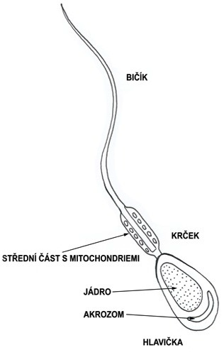
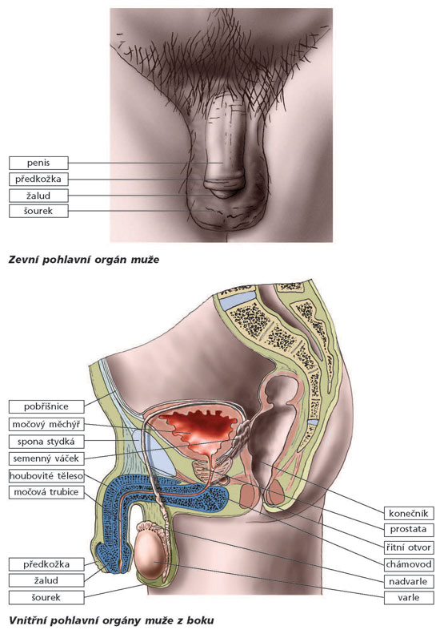

# Pohlavní orgány muže

## Varlata (testes)

- párový orgán, vyvíjí se v břišní dutině; těsně před narozením sestupuje do šourku (snížení teploty - cca o 4 °C)
- délka 4-5 cm
- obsahují semenotvorné kanálky - produkce spermií (spermatogeneze)
- Sertoliho buňky: zajišťují výživu zrajících spermií
- Leydigovy buňky: syntéza hormonů - testosteron (zajišťuje vznik sekundárních pohlavních znaků)

## Spermie

- 0,005 mm (nejmenší buňka těla)
- haploidní = 23 chromozomů
- hromadí se v nadvarleti - zde dozrávají a získávaji pohyblivost
- vytvářejí se od pubery až do smrti (v období plné plodnosti přibližně 100 milionů denně)

### Struktura

- hlavička - obsahuje jádro s haploidní genetickou výbavou (n) a cytoplazmu
- v přední části hlavičky - váček = akrozom - plní funkci lysozomu a slouží k rozručení struktur obalů vajíčka pomocí hydrolytických enzymů
- krček - struktura spojující hlavičku a bičík
- bičík - umožňuje pohyb spermie

## Chámovod

- trubicovitý párový orgán
- délka přibližně 40 cm
- vede od nadvarlete, dutinou břišní, prostupuje prostatou a ústí do močové trubice

## Měchýřkovité žlázy

- ústí do chámovodu
- uloženy na spodní straně močového měchýře
- párové
- produkce sekteru zvyšujícího pohyblivost spermií a zajišťující jejich výživu

## Prostata (předstojná žláza)

- přídatná pohlavní žláza
- leží v oblasti pánevního dna
- velikosti vlašského ořechu
- spolu s měchýřkovitými žlázami obohacuje hlenovitý sekret nadvarlete o výživné a ochranné látky zvyšující životaschopnost spermií -> semeno (ejakulát)
- je zásadité povahy a neutralizuje kyselé pH vaginálního sekretu a napomáhá spermiím k cestě do děložního hrdla

---

- v 1 ml ejakulátu zdravého muže je 120 milionů životaschopných spermií
- močová trubice - společnou vývodnou cestou pro moč a spermie

## Penis

- obsahuje tři topořivá tělesa - tvořena houbovitou tkání s bohatým krevním zásobením
- při naplnění této tkáně krví -> erekce
  - reflex řízen z bederní míchy
- kolem zevního ústí močové trubice - žalud
- penis v oblasti žaludu kryt předkožkou

---

