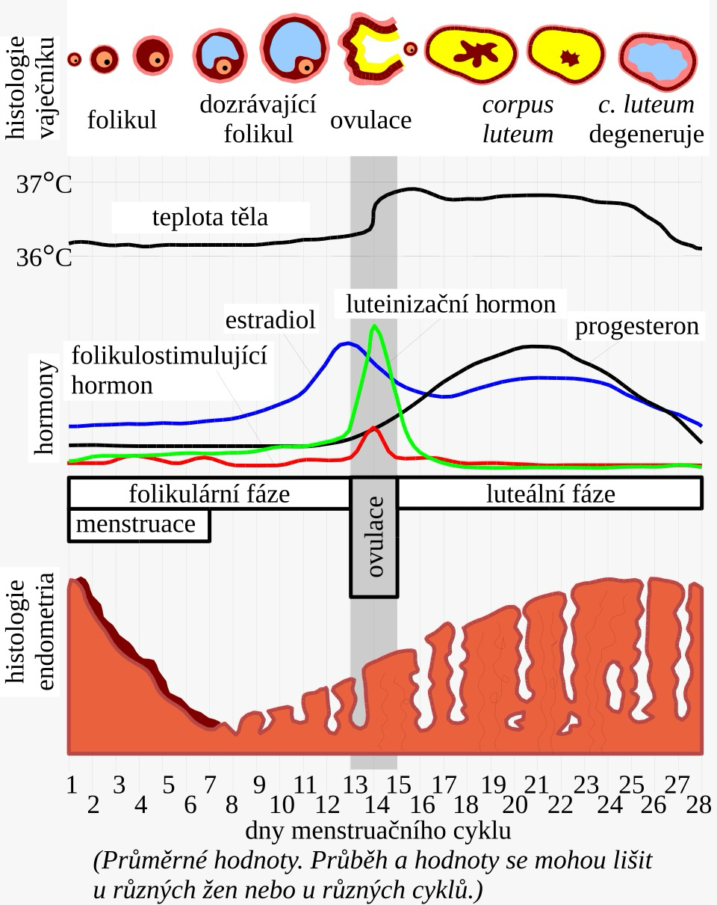

# Ovulační a menstruační cyklus

- od puberty - cyklické změny produkce pohlavních hormonů
  - ve vaječnících - ovulační cyklus
  - děložní sliznice - menstruační
- oba cykly spolu těsně souvisejí

## Ovulační cyklus

### Folikulární fáze

- trvá prvních 14 dní
- vlivem hormonů adenohypofýzy (FSH, LH) rostou oocyty
- v kůře vaječníků se vytváří Graafův folikul (obsahuje zrající vajíčko) - zvyšuje se produkce estrogenů

- mezi 12. a 15. dnem po menstruaci - Graafův folikul praská - uvolněné zralé vajíčko je vypuzeno z vaječníku a zachyceno rozšířenou nálevkou vejcovodu - **OVULACE**
- není-li zachyceno, vajíčko "zapadne" mezi útrobní orgány a je zlikvidováno bílými krvinkami, může dojít také k mimoděložnímu těhotenství
- k uvolnění vajíčka - zvýšená hladina FSH a LH
- vlivem hormonálních změn - dočasné zvýšení tzv. bazální teploty (naměřené v hloubce vaginy u děložního čípku)

### Luteální fáze

- přibližně trvá 14 dnů
- Graafův folikul se mění na žluté tělísko (corpus luteum) - produkuje hormon progesteron
- vajíčko je po ovulacei posouváno vejcovodem, přibližně 1 až 2 dny po ovulaci je schopné oplození
- dojde-li k oplození, je progesteron produkován žlutým tělískem do 6. měsíce těhotenství, kdy produkci progesteronu přebírá placenta
- nedojde-li k oplození, nastupuje znovu folikulární fáze

## Menstruační cyklus

### Menstruační fáze

- 3 až 5 dní
- pokud nedošlo k oplození, žluté tělísko ukončí produkci progesteronu a zaniká
- narostlá děložní sliznice postupně odumírá, odtrhává se ze stěny dělohy a spolu s krví je vyplavována z dělohy pochvou ven = menstruační krvácení

### Proliferační fáze

- 5\. - 12. od začátku cyklu
- po ukonžené menstruaci - regenerace, růst a zbytňování děložní sliznice
- zvyšuje se produkce estrogenů

### Sekreční fáze

- od 12 do 27. dne cyklu (během luteální fáze ovulačního cyklu)
- vlivem estrogenů a progesteronu začne mohutně růst děložní sliznice (je silně prokrvená a její tloušťka se zvětšuje) - příprava na případné uhnízdění oplozeného vajíčka

### Ischemická fáze

- ischemická choroba srdeční included
- 28\. den (24 hodin)
- pokud nebylo vajíčko oplozeno, zaniké žluté tělísko (mění se na bílé tělísko - corpus albicans) a klesá produkce pohlavních hormonů
- odumírá děložní sliznice
