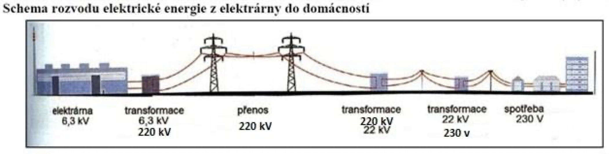
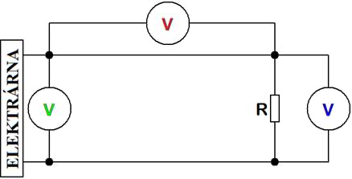

- pomocí přenosové soustavy (ČEPS)
  - soustva vedení se střídavými napětími různé velikosti a trafostanic (rozvoden)

Elektrárna (U\_e = 6 kV) → trafostanice (k \> 1)

- mezinárodní přenos 230, 400, 1000 kV - rozvod na velké vzdálenosti

→ velká krajová rozvodna --23kV→ místní rozvodna → 3x400V/230V

Elektrárny: větrná, tepelná, jaderná, vodní, solární, geotermální, přílivová

$P = U_Z \cdot I \rightarrow P_M = U_M \cdot I$ $P_Č = U_Č \cdot I = U_Č \cdot \frac{P}{U_Z}$ $= R_V \cdot I \cdot \frac{P}{U_Z} = R_V \cdot I^2 = R_V \cdot \frac{P^2}{U_Z^2}$ $I$ → min, $U_Z$ → max