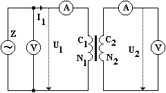
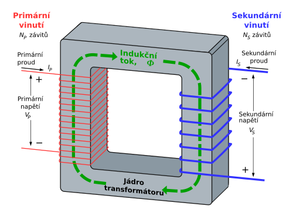
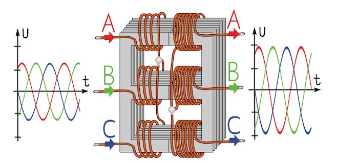

# Tranformátor

- je zařízení, které umožňuje zvyšovat nebo snižovat napětí v rozvodné síti nebo na spotřebiči
- princip - elektromagnetická indukce

1. Jednofázové
2. Trojfázové

## Jednofázový transformátor

Jednofázový tvoří 2 cívky - primární a sekundární - na společném feromagnetickém jádře z magneticky měkké oceli

$$u_1(t) = U_m \cdot \sin{\omega t}$$
$N_1,\, N_2$ - počty závitů cívek

$u_i = -\frac{d\Phi}{dt}$ - 1 závit
$$u_1 = -N_1 \cdot\frac{d\Phi}{dt}$$
$$u_2 = -N_2 \cdot\frac{d\Phi}{dt}$$
$u_1, \, u_2$ - stejná velikost jako na svorkách zdroje, ale opačnou fázi
-> efektivní hodnoty jsou stejné

$$U_1 \sim N_1$$
$$U_2 \sim N_2$$

$$ \frac{U_2}{U_1} = \frac{N_2}{N_1} = k$$

rovnice transformátoru, $k$ - transformační poměr 
$k > 1$ -> transformace na horu  
$k < 1$ -> transformace do dolu

$$P_1 = U_1I_1\cos{\varphi _1}$$
$$P_2 = U_2I_2\cos{\varphi _2}$$

---
ideální transformátor: $P_1 = P_2$

$$\eta \cdot P_1 = P_2$$
$\eta \doteq 90 \div 95 \, \%$ - malé transformátory  
$\eta \doteq 98 \, \%$ - v rozvodně (chlazení ňákym spešl olejem)

$$U_1I_1 \cos{\varphi _1} = U_2I_2 \cos{\varphi _2}$$
$$\varphi _1 \approx \varphi _2 \approx 0$$
$$U_1I_1 = U_2I_2$$
$$\frac{I_1}{I_2} = \frac{U_2}{U_1} = k$$
$$\frac{I_2}{I_1} = \frac{U_1}{U_2} = \frac{1}{k}$$

Proudy se transformují v převráceném poměru než napětí  
Ztráty:

- odpor vodičů
- vznik a zánik magnetického pole
- vířivé (Foucaltovy) proudy v jádře

## Trojfázový transformátor

primární a případně sekundární cívky jsou zapojené do hvězdy nebo do trojúhelníku
