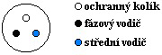

# Třífázová soustava AC

N - nulovací vodič (zelený)  
L1, L2, L3 - fáze (červená, hnědá, modrá)  

$U_1,U_2,U_3 \, (L_1 \div L_3 / N)$ – fázová napětí o efektivní hodnotě 230 V
$$U_m = 230 \cdot \sqrt{2} \doteq 325 \, V$$

$U_{12},U_{23},U_{13}$ – sdružená napětí
$$U_{12} = U \cdot \sin{\omega t} - U \cdot \sin{\omega t - \frac{2}{3} \pi}$$
$$U_{12} = U \cdot 2 \sin{\frac{\omega t - \omega t + \frac{2}{3} \pi}{2}} \cos{\frac{\omega t + \omega t - \frac{2}{3} \pi}{2}}$$
$$U_{12} = U \cdot \sqrt{3} \cos{(\omega t - \frac{2}{3}\pi)}$$
$$U_{12m}=U_{13m}=U_{23m}=\sqrt{3} \cdot U = \sqrt{3} \cdot 230 \doteq 400 \, V$$

