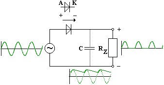
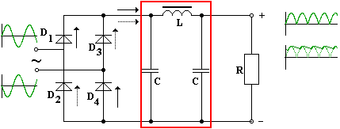

# Usměrňovač střídavého proudu

Graetzův můstek (soustava diod)

Cívka a kapacitory tlumí skoky proudu (viz. níže graf)

tlumivka: f < -> ocelové jádro cívky, hodně závitů
f >> -> feritové jádro, 1 až 2 závity
