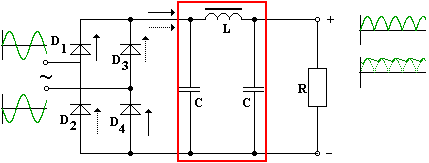

<Frame>
  
</Frame>

<Frame caption="Graetzův můstek (soustava diod)">
  
</Frame>

Cívka a kapacitory tlumí skoky proudu (viz. níže graf)

tlumivka: f \< → ocelové jádro cívky, hodně závitů f \>\> → feritové jádro, 1 až 2 závity