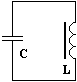
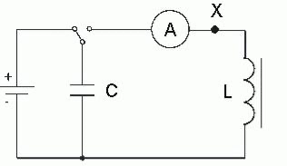
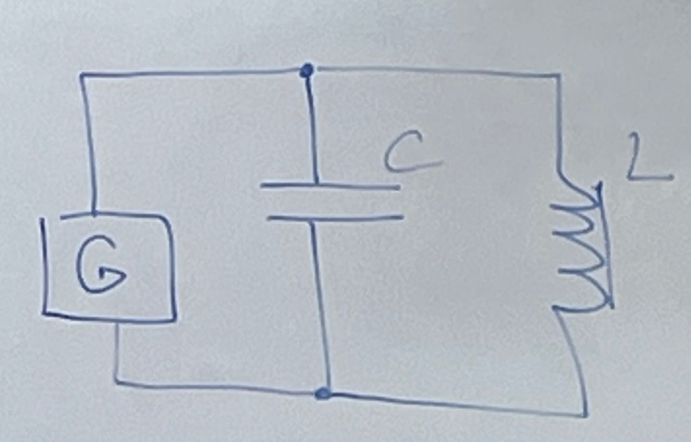
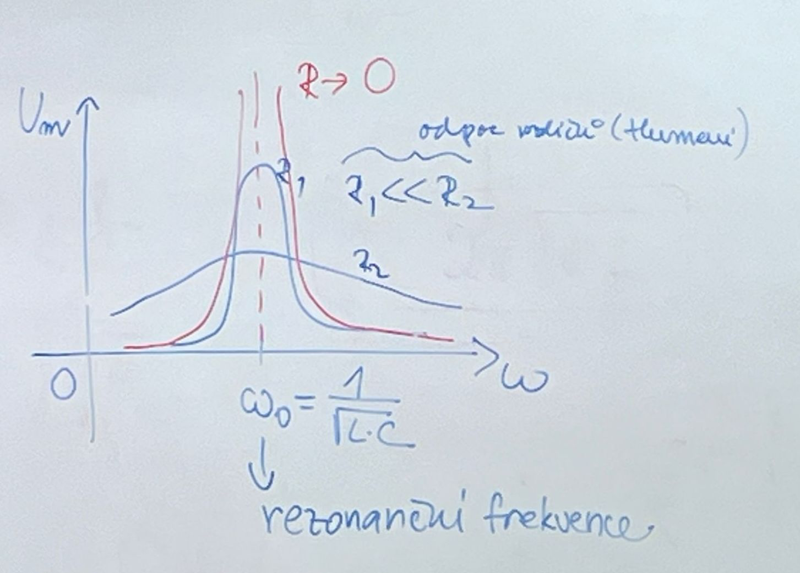

$u(t) = U_m \cdot \sin{\omega t + \varphi}$ $i(t) = I_m \cdot \sin{\omega t}$

Jednoduchý oscilační obvod:

$Q = C \cdot U$

- kondenzátor nabijeme

<iframe src="https://www.desmos.com/calculator/xfu3tc8xz4" width="500" height="500" style="border: 1px solid #ccc" />

$\Delta \varphi = \frac{T}{4}$

$R$ → 0: Dochází k periodické přeměně energie elektrického pole (kondenzátor) na energii mg. pole (cívka) a naopak - **ELEKTROMAGNETICKÝ OSCILÁTOR**

| Mech | El-mag |
| --- | --- |
|  |  |
|  |  |
|  |  |
|  |  |
|  |  |
|  |  |
|  |  |

## Parametry oscilátoru

- $R$ → 0 → volné kmitání
- $u(t) = U_m \cdot \cos{\omega t}$
- $i(t) = I_m \cdot \cos{(\omega t - \frac{\pi}{2})} = I_m \cdot \sin{\omega t}$

::: details Odvození

$X_C = \frac{1}{\omega \cdot C}$ $X_L = \omega \cdot L$ $U_C = U_L$ $ I \cdot X_C = I \cdot X_L$ $\omega_0 = \frac{1}{\sqrt{L \cdot C}}$

→ vlastní kruhová frekvence kmitání

:::

::: tip Thomsonův vztah pro vlastní periodu kmitání el. mag. oscilátoru

$T_0 = 2 \pi \sqrt{L \cdot C}$

:::

- každé elektromagnetické kmitání je vždy tlumené, protože $R$ je nenulový \+ přeměny energie

$R$ → $\infty$ - přetlumeno - ke kmitání nedojde

$u(t) = U_{mG} \cdot \sin{(\omega_G \cdot t)}$

- v případě připojení generátoru oscilátor kmitá s frekvencí generátoru
  - nucené kmitání

- $\omega _G \rightarrow \omega _0$ → stav rezonance LC-obvodu
- malá energie generátoru způsobí velkou amplitudu výchylky
- změnou kapacity kondenzátoru měníme frekvenci toho generátoru a tedy oscilačního obvodu