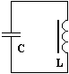
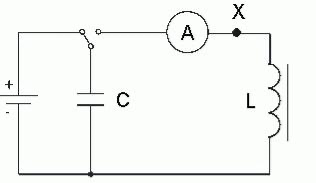
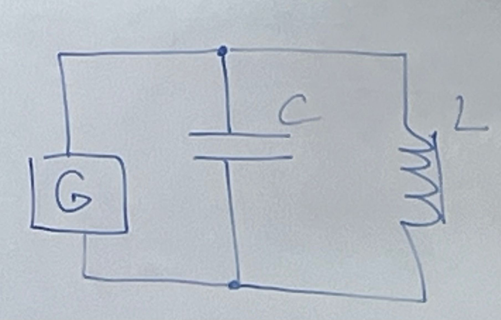
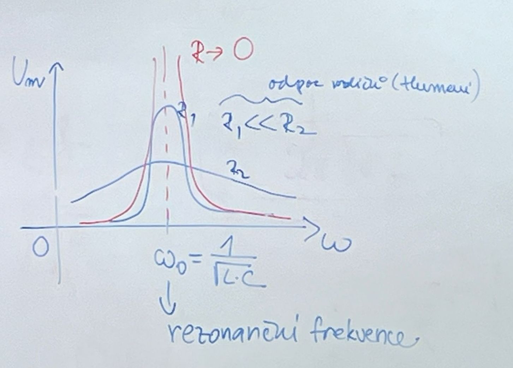

$$u(t) = U_m \cdot \sin{\omega t + \varphi}$$ $$i(t) = I_m \cdot \sin{\omega t}$$

Jednoduchý oscilační obvod:

<Frame>
  

  
</Frame>

$$Q = C \cdot U$$

- kondenzátor nabijeme

<Frame>
  <iframe src="https://www.desmos.com/calculator/xfu3tc8xz4" />
</Frame>

$$\Delta \varphi = \frac{T}{4}$$

$$R$$ → 0: Dochází k periodické přeměně energie elektrického pole (kondenzátor) na energii mg. pole (cívka) a naopak - **ELEKTROMAGNETICKÝ OSCILÁTOR**

| Mech | El-mag |
| --- | --- |
| $$E_K$$ | $$E_M$$ |
| $$E_p$$ | $$E_e$$ |
| okamžitá výchylka      $$y$$ | náboj:      $$q$$ |
| síla:      $$F$$ | napětí:      $$u(t)$$ |
| rychlost:      $$v$$ | proud:      $$i(t)$$ |
| hmotnost:      $$m$$ | indukčnost:      $$L$$ |
| tuhost:      $$k = \frac{F}{y}$$ | převrácená kapacita:      $$\frac{1}{C}=\frac{u}{q}$$ |

## Parametry oscilátoru

- $$R$$ → 0 → volné kmitání
- $$u(t) = U_m \cdot \cos{\omega t}$$
- $$i(t) = I_m \cdot \cos{(\omega t - \frac{\pi}{2})} = I_m \cdot \sin{\omega t}$$

<Note>
  $$X_C = \frac{1}{\omega \cdot C}$$ $$X_L = \omega \cdot L$$ $$U_C = U_L$$ $$ I \cdot X_C = I \cdot X_L$$ $$\omega_0 = \frac{1}{\sqrt{L \cdot C}}$$

  → vlastní kruhová frekvence kmitání
</Note>

<Card title="Thomsonův vztah pro vlastní periodu kmitání el. mag. oscilátoru" type="note">
  $$T_0 = 2 \pi \sqrt{L \cdot C}$$
</Card>

- každé elektromagnetické kmitání je vždy tlumené, protože $$R$$ je nenulový \+ přeměny energie

$$R$$ → $$\infty$$ - přetlumeno - ke kmitání nedojde

<Frame>
  
</Frame>

$$u(t) = U_{mG} \cdot \sin{(\omega_G \cdot t)}$$

- v případě připojení generátoru oscilátor kmitá s frekvencí generátoru
  - nucené kmitání

<Frame>
  
</Frame>

- $$\omega _G \rightarrow \omega _0$$ → stav rezonance LC-obvodu
- malá energie generátoru způsobí velkou amplitudu výchylky
- změnou kapacity kondenzátoru měníme frekvenci toho generátoru a tedy oscilačního obvodu