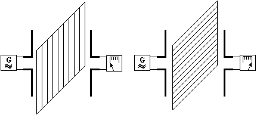
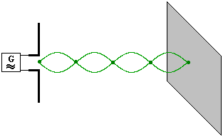

## 1. Má dvě neoddělitelné složky

- $\vec{E}$ – elektrickou
- $\vec{B}$ – magnetickou

které harmonicky kmitají ve fázi a jsou na sebe kolmé $\vec{E} \perp \vec{B}$, $\vec{E} \perp \vec{c}$, $\vec{B} \perp \vec{c}$ -\> příčné vlnění

## 2. Lineárně polarizované

- el. mag. vlnění je lineárně polarizované
- vektory $\vec{E}$ a $\vec{B}$ zůstavají ve stejné
  - $\vec{E}$ v rovině dipólu, $\vec{B}$ v rovině kolmé

- v prvním případě (rotované stejně) to neprojde, funguje jako rezonátor -\> pohltí vlnění
- v druhém případě (rotované kolmo) to projde

## 3. Odraz a ohyb

- el. mag. vlnění se odráží a projevuje se ohyb
  - odraz je největší při dopadu na vodivé plochy
- při kolmém dopadu se odráží zpět k vysílači a tvoří se stojaté vlnění
- dipól v místě kmitny zesílí signál

- parabolické antény pro příjem televize, RADARY

- odrazem dochází k zesílení signálu

---

- při ohybu okolo překážek musí být rozměry menší než vlnová délka $\lambda$

## Rychlost šíření

$c = \frac{1}{\sqrt{\varepsilon _0 \cdot \mu _0}}$ $v = \frac{1}{\sqrt{\varepsilon \cdot \mu}} = \frac{1}{\sqrt{\varepsilon _0 \cdot \varepsilon _r \cdot \mu _0 \cdot \mu _r}} = \frac{c}{\sqrt{\varepsilon _r \cdot \mu _r}}$ $ \varepsilon _r \ge 1, \, \mu _r \ge 1$

Voda: $v = \frac{1}{9} c$ $\lambda = \frac{1}{9} \lambda _0$

### Radar

$\lambda = 1 \, cm \div 50 \, cm$ $ l = \frac{c \cdot t}{2}$

- objekt je zobrazen pomocí sférických souřadnic $[l; \varphi; \psi]$

.webp)