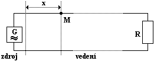
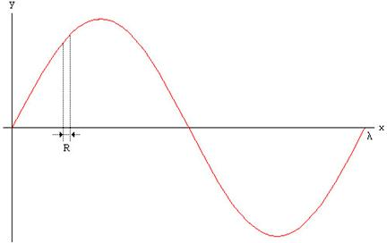
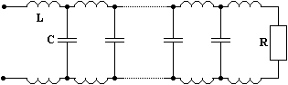
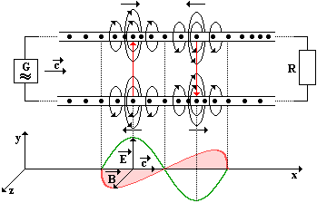
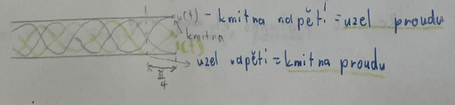
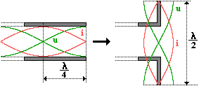
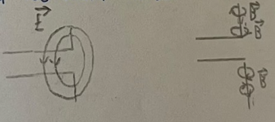
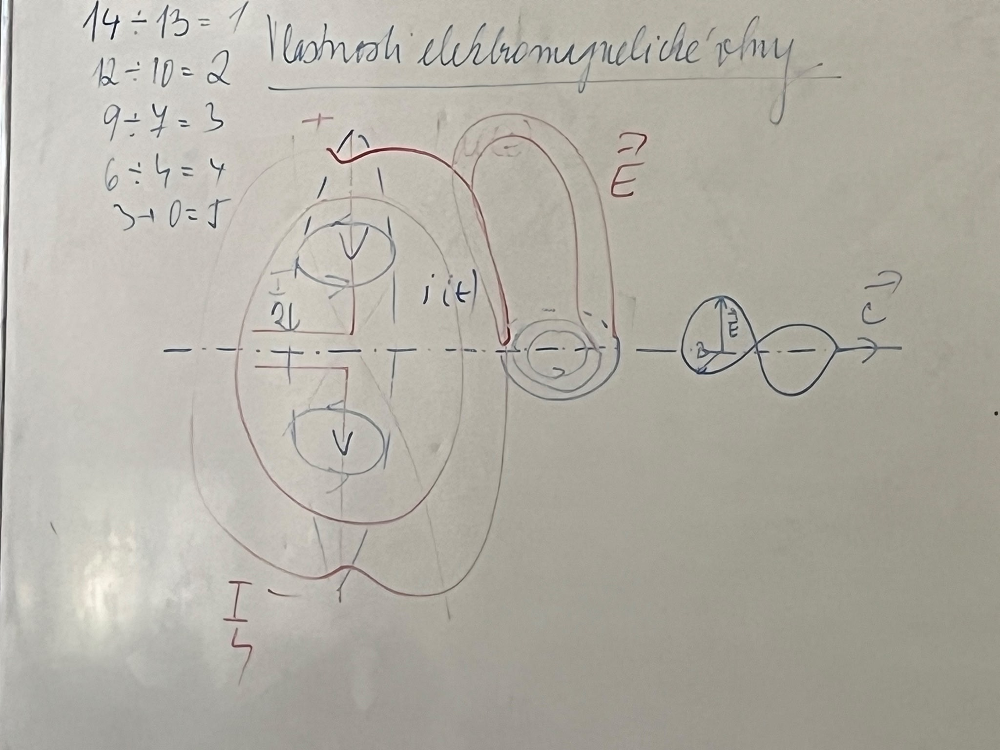

$u(t) = U_m \cdot \sin{\omega t}$

- rychlost šíření: $c$ - rychlost světla

$c = \frac{1}{\sqrt{\varepsilon _0 \cdot \mu _0}}$ $c = 299 \, 792 \, 458 \, m \cdot s^{-1} \doteq 3 \cdot 10^8 \, m \cdot s^{-1}$

$\tau = \frac{x}{c}$

::: details Odvození

$u(t) = U_m \cdot \sin{\frac{2\pi}{T}(t - \tau)}$ $u(t) = U_m \cdot \sin{\frac{2\pi}{T}(t - \frac{x}{c})}$ $u(t) = U_m \cdot \sin{2\pi(\frac{t}{T} - \frac{x}{c \cdot T})}$

:::

- $c \cdot T = \lambda$ - vlnová délka

$u(t) = U_m \cdot \sin{2\pi(\frac{t}{T} - \frac{x}{\lambda})}$

- rovnice postupné el. mag. vlny
- $\frac{t}{T} \gg \frac{x}{\lambda}$ - nemá charakter vlnění, ale kmitání

$\lambda = \frac{c}{f}$ $u(x;t) = U_m \cdot \sin{2 \pi (\frac{t}{T} - \frac{x}{\lambda})}$

- náboj je podél vedení rozložen nerovnoměrně
- náboj se pohybuje a podél vodiče vznikají magnetická pole
- na konci vedení je rezistor → napětí či proud jsou ve fázi
- místa s největší intenzitou el. pole a místa s největší indukcí mg. pole jsou stejná

- má dvě neoddělitelné složky - elektrickou $\vec{E}$ a magnetickou $\vec{B}$
  - ty jsou na sebe kolmé $\vec{E} \perp \vec{B}$ a jsou ve fázi $\Delta \varphi = 0 \, rad$

 

- vedení naprázdno - R → $\infty$
  - původní vlna se odráží a skládá se s původní vlnou a vzniká stojaté vlnění

## Elektromagnetický dipól

$\Delta \varphi = \frac{\pi}{2}$

- složky $\vec{E}$ a $\vec{B}$ jsou posunuty o $\frac{\pi}{2}$
- přeměna energie el. pole na energii mg. pole

- půlvlný dipól
- tím lze dostat vlnění z vedení do prostoru

