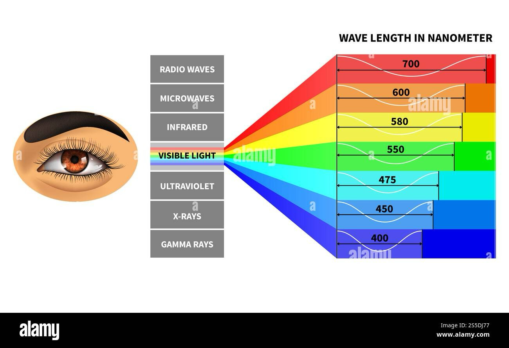

- Je elektromagnetické vlnění těch frekvencí (vln. délek), na které je citlivý lidský orgán zraku - oko, tj. vyvolává v něm fyziologický proces vidění.

::: details Frekvence $f = 7,7 \cdot 10^14 \div 3,9 \cdot 10^14 \, \mathrm{Hz}$ :::

$\lambda = 390 \div 760 \, \mathrm{nm}$

- Má rychlost $c = 299 \, 792 \, 458 \, \mathrm{m \cdot s^{-1}}$
- Nejvyšší rychlost vesmíru, kterou může nějaký objekt dosáhnout. V látkovém prostředí je vždy menší než ve vakuu, např. voda $c = 225 000 \, \mathrm{km} \cdot \mathrm{s^{-1}}$

---

- Středověk: Je nekonečně velká - Galilei 1607
- Poprvé určil konečnou hodnotu Olaf Römer 1675 a měla velikost $c = 214 \, 300 \, \mathrm{km \cdot s^{-1}}$, vycházel z astronomických pozorování (o 30 % nižší než ve skutečnosti je). Dodnes přes 100 různých metod a pozorování, dnes měření frekvence a vln. délky helium-neonového laseru, kdy předpokládáme odchylky $\Delta c = \pm 1,2 \, \mathrm{m \cdot s^{-1}}$

---

- Pomocí rychlosti světla je definována základní jednotka soustavy SI metr:

::: tip Metr Metr je délka dráhy, kterou urazí světlo ve vakuu v časovém intervalu $\frac{1}{299 \, 792 \, 458}$ sekundy (hodnotu bereme přesně bez odchylky). :::

- Platí ve vakuu: $\lambda = \frac{c}{f} = c \cdot T$, v látkovém prostředí je rychlost $v = \frac{1}{\sqrt{\varepsilon \cdot \mu}}$
- Světla různých frekvencí se liší barvou: $390 \, nm$ -\> modrá -\> zelená -\> žlutá -\> oranžová -\> červená -\> $760 \, \mathrm{nm}$

<Frame>
  
</Frame>

- Nejcitlivější je lidské oko na vlnovou délku okolo $550 \, \mathrm{nm}$ - žlutozelená

---

$\lambda < 390 \, \mathrm{nm}$ - ultrafialové záření, $\lambda > 760 \, \mathrm{nm}$ - infračervené záření

---

- Některé zdroje (lasery) vyjadřují jen světlo určité frekvence - **monofrekvenční světlo = monochromatické světlo**, protože má jedinou barvu (ideál). Ve skutečnosti se jedná o nějaký interval frekvencí, který je ovlivněn vlastnostmi zdroje světla nebo úpravou pomocí barevných filtrů.
- Běžné zdroje: žářivka, žárovka, Slunce vyzařují světlo o mnoha různých frekvencích = **složené světlo**. Jestliže jsou ve složeném světle zastoupeny monofrekvenční složky všech frekvencí z viditelné oblasti záření, používáme pojem **bílé světlo**. (Stejný vjem lze ale vytvořit jen pomocí několika monofrekvenčních složek, které jsou ve složeném světle v určitém poměru.)