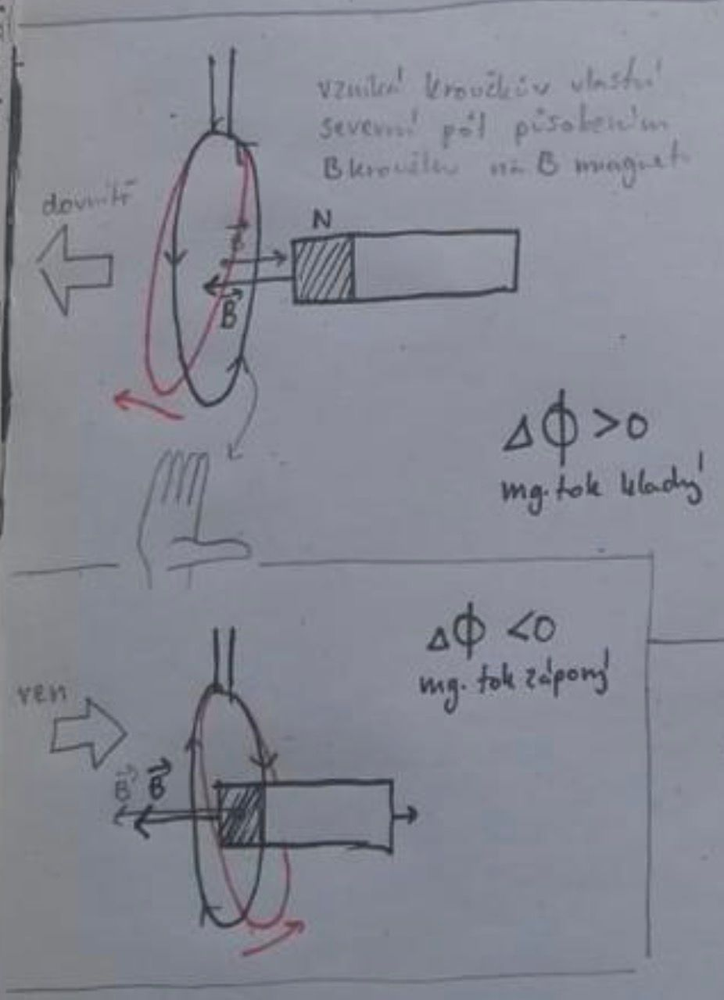

::: tip Lenzův zákon Indukovaný proud v uzavřeném elektrickém obvodu má takový směr, že svým magnetickým polem působí proti změně magnetického indukčního toku, která ho vyvolala. ::: 

- V kroužku je indukovaný proud $I_i = \frac{U_i}{R}$
- Proud jde proti změně $d\Phi$,

$U_i = -\frac{d\Phi}{dt}$