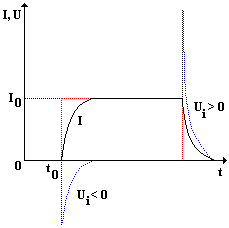

# Přechodný děj a energie magnetického pole cívky

## Přechodný děj

$$ I = \frac{U_e + U_i}{R}=\frac{Ue-L \cdot \frac{\Delta I}{\Delta t}}{R}$$

## Energie magnetického pole cívky

Rychlost přeměny energie elektrického pole na energii megnetického pole závisí na indukčnosti $L$.
Musíme vykonat práci $\Delta W = \Phi_p \cdot \Delta I$

Celková energie $E_m$ magentického pole cívky, kterou prochází ustálný proud $I_0$: 
$$E_m=\frac{1}{2}LI_0^2$$
