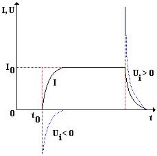

# Přechodný děj a energie magnetického pole cívky

## Přechodný děj

<Frame>
  
</Frame>

$$ I = \frac{U_e + U_i}{R}=\frac{Ue-L \cdot \frac{\Delta I}{\Delta t}}{R}$$

## Energie magnetického pole cívky

Rychlost přeměny energie elektrického pole na energii magnetického pole závisí na indukčnosti $$L$$. Musíme vykonat práci $$\Delta W = \Phi_p \cdot \Delta I$$

Celková energie $$E_m$$ magnetického pole cívky, kterou prochází ustálený proud $$I_0$$: $$E_m=\frac{1}{2}LI_0^2$$